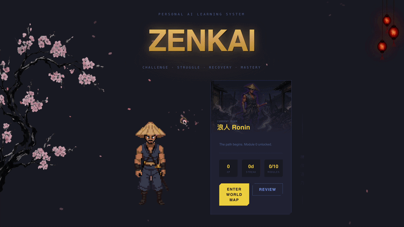
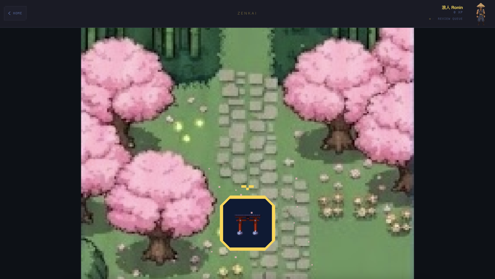
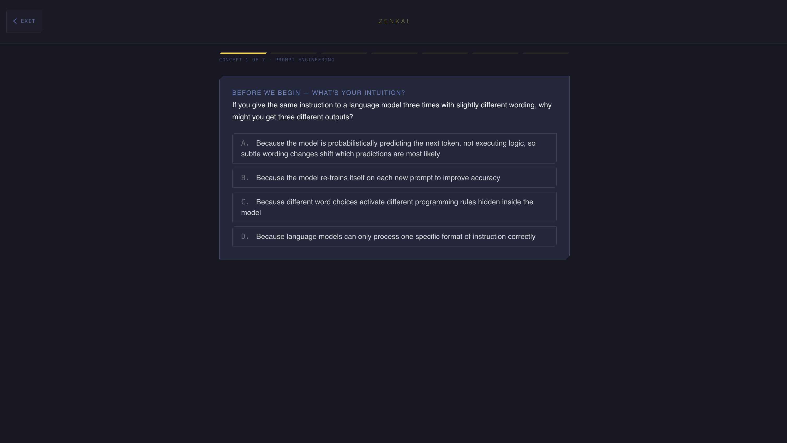

# Zenkai

A personalized AI learning system powered by spaced repetition, concept mastery, and character evolution.

**Status: Coming Soon**

---

## Experience

### Home Screen & World Map


### World Map


### Learning Flow


---

## What is Zenkai?

Zenkai transforms an AI knowledgebase into an interactive learning experience. Built on three core principles:

- **Challenge → Struggle → Recovery → Mastery** — SM-2 spaced repetition ensures you review concepts at optimal intervals
- **Character Progression** — Your learning journey is reflected in character evolution: Ronin → Warrior → Samurai → Ghost
- **Quiz-Based Unlock Gating** — Master each module before advancing to the next

The system uses Claude Sonnet/Haiku for content generation, SQLite for persistent progress tracking, and Framer Motion for smooth, meaningful animations.

---

## Tech Stack

| Layer | Technology |
|---|---|
| Frontend | Next.js 14 (App Router) + React 18 + Tailwind + Framer Motion |
| Backend | FastAPI (Python 3.11+) |
| Database | SQLite |
| Learning Engine | SM-2 spaced repetition + confidence-rated recall |
| AI | Claude Sonnet/Haiku (Anthropic SDK) |
| Pixel Assets | PixelLab (AI-generated pixel art) |

---

## Project Structure

```
zenkai/
├── frontend/              # Next.js 14 app (App Router)
│   ├── app/              # Page components
│   ├── components/       # UI components
│   ├── lib/             # Shared logic, types, queryKeys
│   └── public/          # Static assets
├── backend/             # FastAPI application
│   ├── routers/         # API endpoints (modules, concepts, quiz, progress, pipeline)
│   ├── pipeline/        # Content generation orchestrator
│   ├── migrations/      # Database migration scripts
│   ├── zenkai.db        # SQLite database
│   └── schema.sql       # Database schema
├── docs/
│   ├── plans/          # Implementation plans and architecture
│   └── readme-assets/  # Screenshots and GIFs
└── .env.example         # Environment variables template
```

---

## Getting Started (Local Development)

### Prerequisites

- Python 3.11+
- Node.js 18+
- `ANTHROPIC_API_KEY` environment variable

### Installation

1. **Clone and setup:**
   ```bash
   git clone https://github.com/trentjhn/zenkai.git
   cd zenkai
   ```

2. **Backend:**
   ```bash
   cd backend
   python -m venv venv
   source venv/bin/activate  # or `venv\Scripts\activate` on Windows
   pip install -r requirements.txt
   ```

3. **Frontend:**
   ```bash
   cd frontend
   npm install
   ```

4. **Environment:**
   ```bash
   # Copy from template and add your ANTHROPIC_API_KEY
   cp .env.example .env
   ```

### Running Locally

**Option 1: Docker Compose (Recommended)**
```bash
docker-compose up
```
- Frontend: `http://localhost:3000`
- Backend: `http://localhost:8000`

**Option 2: Manual**

Terminal 1 (Backend):
```bash
cd backend
venv/bin/uvicorn main:app --port 8000 --reload
```

Terminal 2 (Frontend):
```bash
cd frontend
npm run dev
```

---

## Content Pipeline

The system generates structured learning content from an AI knowledgebase:

```bash
# Generate concepts for a module
POST /pipeline/sync {"module_id": 2}

# Generate quiz questions for a module
POST /pipeline/sync-quiz {"module_id": 2}
```

Access the API docs at `http://localhost:8000/docs` (FastAPI Swagger UI).

---

## Testing

**Backend (pytest):**
```bash
cd backend
venv/bin/pytest tests/ -q
```

**Frontend (Vitest):**
```bash
cd frontend
npm run test
```

**E2E (Playwright):**
```bash
npm run test:e2e
```

---

## Design Principles

- **No rounded corners** — Uses clipped-corner clip-path utilities for a distinctive shape language
- **Energy registers** — Study mode (cool tones) and Battle mode (warm, high-energy)
- **Framer Motion** — Meaningful transitions communicate state change
- **TypeScript strict mode** — No `any` types, all API responses typed
- **SQLite first** — SQLite is the single source of truth for all user state

---

## Architecture Highlights

- **Content vs. User Data Separation** — Content tables (modules, concepts, quiz_questions) are written only by the pipeline. User data (progress, schedule, sessions) is managed only by the API.
- **Delta Detection** — Concepts only regenerate if their KB source section hash has changed, saving API calls and credits.
- **Idempotent Module Completion** — `POST /modules/{id}/complete` is fully idempotent — calling it multiple times with the same score won't corrupt state.
- **SM-2 Scheduling** — Review intervals follow the SM-2 algorithm; difficulty adjustments are confidence-rated.

---

## Documentation

- **Design Doc:** `docs/plans/2026-02-28-zenkai-design.md` — Full architecture, schema, algorithms, and known issues
- **Implementation Plans:** `docs/plans/` — Feature-by-feature design rationale

---

## License

Personal use only. Not licensed for public distribution.

---

**Built with ❤️ for deep, personalized learning.**
